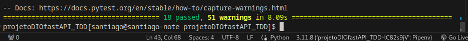
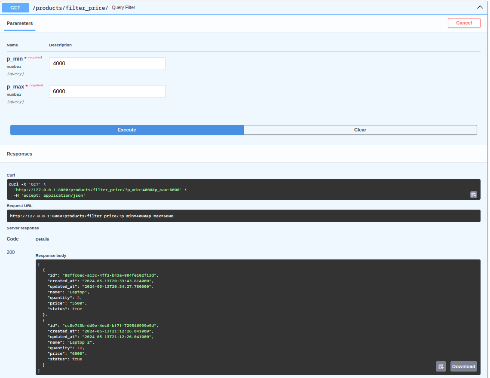

<h1>
    <a href="https://www.dio.me/">
     </a>
    <span> Python AI Backend Developer </span>
</h1>


# :computer: Desafio de projeto:

## Criando Uma API Com FastAPI Utilizando TDD

### Entendendo o Desafio

Essa aplicação tem como objetivo principal trazer conhecimentos sobre o TDD, na prática, desenvolvendo uma API com o Framework Python, FastAPI. Utilizando o banco de dados MongoDB, para validações o Pydantic, para os testes Pytest e entre outras bibliotecas.

Projeto instrutora:
https://github.com/digitalinnovationone/store_api

### Desafio Final
- Create

Mapear uma exceção, caso dê algum erro de inserção e capturar na controller

- Update

Modifique o método de patch para retornar uma exceção de Not Found, quando o dado não for encontrado
a exceção deve ser tratada na controller, pra ser retornada uma mensagem amigável pro usuário
ao alterar um dado, a data de updated_at deve corresponder ao time atual, permitir modificar updated_at também

- Filtros

Cadastre produtos com preços diferentes e aplique um filtro de preço, assim: (price > 5000 and price < 8000)

# :zap:  Tecnologias Utilizadas

- pipenv - controle de versão
- MongoDB Atlas - banco de dados na nuvem
- Pymongo + Pydantic + motor - conexão com banco de dados
- FastAPI - desenvolver a aplicação
- Pytest - testes do código

# :bulb: Solução do desafio

O código foi feito seguindo a aula da instrutora. Porém utilizei o pipenv ao invés do poetry para controle de versão e o MongoDB Atlas para o banco de dados na nuvem ao invés de usar o docker para não precisar instalar o mongodb.

A versão do MongoDB não utilizava a versão uuid4 (https://pymongo.readthedocs.io/en/stable/examples/uuid.html#configuring-uuid-representation), então adicionei "uuidRepresentation='standard'" no arquivo store/mongodbAtlas.py:

```python
AsyncIOMotorClient(settings.DATABASE_URL, server_api=ServerApi('1'), uuidRepresentation='standard')
```
Todos os testes passaram.



## Desafios

 ### Create
 - Mapear uma exceção, caso dê algum erro de inserção e capturar na controller

Modifiquei a função create em <b>store/usecases/product.py</b> com try e except para capturar o erro.

```python
async def create(self, body: ProductIn) -> ProductOut:
        product_model = ProductModel(**body.model_dump())

        try:
            await self.collection.insert_one(product_model.model_dump())
        except:
            raise Exception("Error: Product Not Inserted")

        return ProductOut(**product_model.model_dump())
```
Defini uma entrada de dados incorreta em <b>tests/factories.py</b>

```python
def product_data_errado():
    return {'name': 10, 'quantity': '10', 'price': '8.500', 'status': True}
```

Então ajustei um novo teste em (<b>tests/controllers/test_product.py</b>) após verificar o código do erro

```python
async def test_controller_create_should_return_not_inserted(client, products_url):

    response = await client.post(products_url, json=product_data_errado())
    assert response.status_code == status.HTTP_422_UNPROCESSABLE_ENTITY
```

### Update

-  Modifique o método de patch para retornar uma exceção de Not Found, quando o dado não for encontrado
a exceção deve ser tratada na controller, pra ser retornada uma mensagem amigável pro usuário
ao alterar um dado, a data de updated_at deve corresponder ao time atual, permitir modificar updated_at também

Para também poder atualizar o updated_at modifiquei a classe ProductUpdate em <b>store/schemas/product.py</b>

```python
class ProductUpdate(BaseSchemaMixin):
    quantity: Optional[int] = Field(None, description="Product quantity")
    price: Optional[Decimal_] = Field(None, description="Product price")
    status: Optional[bool] = Field(None, description="Product status")
    updated_at: Optional[datetime] = Field(default_factory=datetime.utcnow, description='Product update time')
```

Modifiquei o endpoint para capturar o erro em <b>store/controllers/product.py</b>

```python
@router.patch(path="/{id}", status_code=status.HTTP_200_OK)
async def patch(
    id: UUID4 = Path(alias="id"),
    body: ProductUpdate = Body(...),
    usecase: ProductUsecase = Depends(),
    ) -> ProductUpdateOut:
    try:
        return await usecase.update(id=id, body=body)
    except NotFoundException as exc:
        raise HTTPException(status_code=status.HTTP_404_NOT_FOUND, detail=exc.message)
```

E modifiquei a função update da classe ProductUsecase para retornar a mensagem de erro:

```python
async def update(self, id: UUID, body: ProductUpdate) -> ProductUpdateOut:
        try:
            result = await self.collection.find_one_and_update(
                filter={"id": id},
                update={"$set": body.model_dump(exclude_none=True)},
                return_document=pymongo.ReturnDocument.AFTER
            )
            return ProductUpdateOut(**result)
        except:
            raise NotFoundException(message = f'Product not found with filter: {id}')
```

Finalmente adicionei um novo teste em <b>tests/controllers/test_product.py</b>

```python
async def test_controller_patch_should_return_not_found(client, products_url, product_inserted):
    response = await client.patch(f"{products_url}2a53ae4d-604a-465a-93b7-a9656da82039", json={"price": "7.500"})

    assert response.status_code == status.HTTP_404_NOT_FOUND
    assert response.json() == {'detail': 'Product not found with filter: 2a53ae4d-604a-465a-93b7-a9656da82039'}

```

### Filtros

- Cadastre produtos com preços diferentes e aplique um filtro de preço, assim: (price > 5000 and price < 8000)

Para filtrar o valor de preço, defini a função em <b>store/usecases/product.py</b>

```python
 async def query_filter_price(self, p_min:float, p_max: float) -> List[ProductOut]:
        return [ProductOut(**item) async for item in self.collection.find(
             filter = {"price": { "$gte": p_min, "$lte": p_max }})]
```
E adicionei o endpoint em <b>store/controllers/product.py</b>

```python
@router.get(path="/filter_price/", status_code=status.HTTP_200_OK)
async def query_filter(
    p_min: float,
    p_max: float,
    usecase: ProductUsecase = Depends()
    ) -> List[ProductOut]:

    return await usecase.query_filter_price(p_min, p_max)
```

Testei na aba <b>/docs</b> do API



## Gihub commit

Com o pre-commit obtive os errors

```console
- hook id: ruff
- exit code: 1

store/usecases/product.py:22:9: E722 Do not use bare `except`
store/usecases/product.py:54:9: E722 Do not use bare `except`
Found 2 errors.
```

Então modifiquei referidas linhas no arquivo:

```python
22 except Exception as ex:
            raise ex("Error: Product Not Inserted")

54 except Exception:
            raise NotFoundException(message=f"Product not found with filter: {id}")
```
